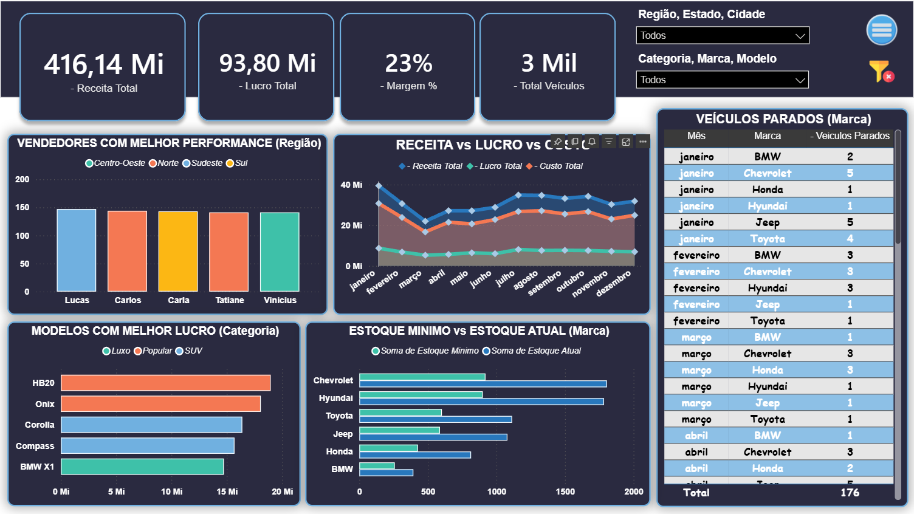
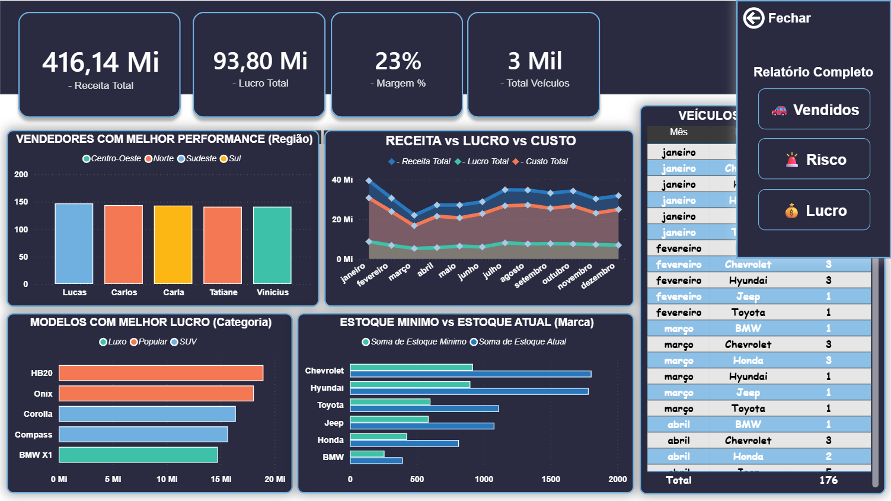
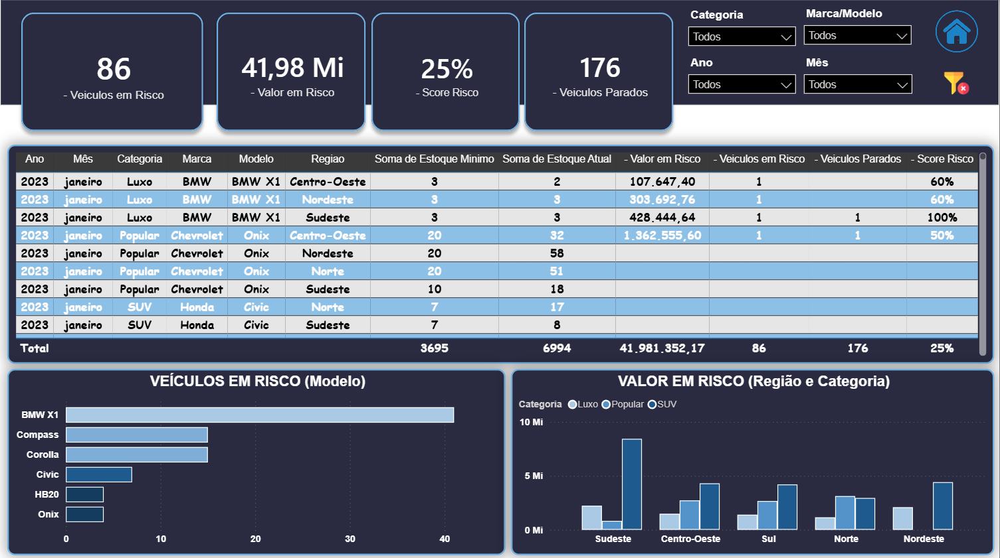
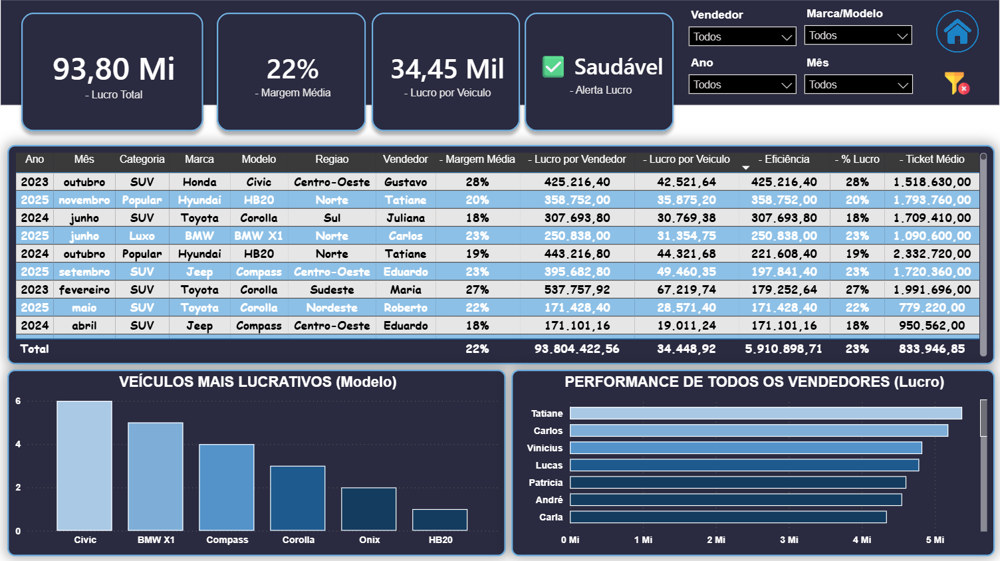
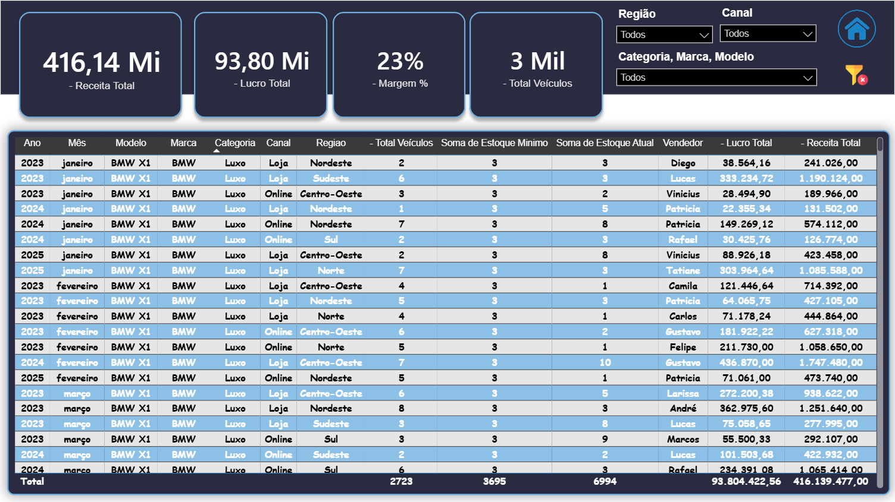

# 🚗 Dashboard Power BI — Análise de Vendas Automotivas

## 📊 Sobre o Projeto

Este projeto tem como objetivo simular um cenário real de uma concessionária de veículos, focando nas principais dores do negócio:

- 📉 Estoque parado
- 🚨 Risco financeiro
- 💰 Rentabilidade
- 🚗 Performance de vendas

O dashboard foi desenvolvido no Power BI com foco em análise estratégica, experiência do usuário (UX) e tomada de decisão orientada por dados.

---

## 🎯 Principais Insights do Projeto

O relatório responde perguntas críticas como:

- Quais veículos mais vendem?
- Onde estão os maiores riscos de estoque?
- Quais produtos geram mais lucro?
- Quais vendedores têm melhor performance?
- Estamos vendendo ou lucrando?

---

## 🧠 Estrutura do Dashboard

### 🏠 Visão Geral
- Receita Total
- Lucro Total
- Margem (%)
- Total de veículos
- Análise temporal (Receita vs Lucro vs Custo)
- Performance por vendedor
- Comparação de estoque mínimo vs atual

---

### 🚨 Em Risco
- Veículos em risco
- Valor financeiro em risco
- Score de risco
- Veículos parados

**Análises:**
- Estoque crítico por modelo
- Valor em risco por região e categoria
- Tabela detalhada com indicadores de risco

---

### 💰 Maior Lucro
- Lucro total
- Margem média
- Lucro por veículo
- Alerta de rentabilidade

**Análises:**
- Ranking de veículos mais lucrativos
- Performance por vendedor
- Eficiência de vendas

---

### 🚗 Veículos Vendidos
- Análise detalhada de vendas por:
  - Região
  - Canal
  - Categoria
  - Vendedor

---

## ⚙️ Tecnologias Utilizadas

- Power BI
- Power Query (M)
- DAX (Data Analysis Expressions)
- Excel (base de dados simulada)

---

## 🔥 Diferenciais do Projeto

- 🎯 Foco em dor real do negócio
- 📊 Métricas avançadas (Score de risco, eficiência, ranking)
- 🎛 Navegação interativa entre páginas
- 🎨 Design moderno e responsivo
- 🧠 Modelagem pensada para análise estratégica

---

## 📈 Principais Métricas Criadas

- Valor em Risco
- Score de Risco
- Veículos Parados
- Margem %
- Eficiência de Vendas
- Ranking dinâmico por lucro e risco

---

## 🚀 Conclusão

Este projeto demonstra como dados podem ser utilizados para transformar informações em decisões estratégicas, ajudando empresas a:

- Reduzir prejuízos
- Otimizar estoque
- Aumentar lucratividade
- Melhorar performance comercial

---

## 📎 Autor: Jocival Almeida

Projeto desenvolvido para fins de portfólio e prática avançada em Power BI.
